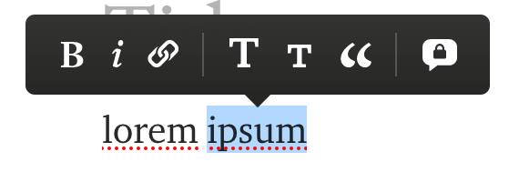

Hooks has been a great addition to React. I feel like my components are more fun to write, often more readable and a bit more logical. I did have a hard time adjusting to the idea of dependency arrays, but now it just feels natural. Some of the hooks are straight-forward. `useState`, `useReducer` and `useContext` are quite easy to wrap your head around. But others require a bit more experimentation to fully understand. I would like to explain `useImperativeHandle` in this post.

## Focus Management

A great use-case for `useImperativeHandle` is focus management in a custom input component. This input component we are building is doing a bit more than the built-in input tag. It will support a `multiline` prop. When set to true, it renders as a `textarea` instead of a normal `input`. It also takes a `label` prop which associates a label text to the input. It could look something like this:

```js
import React from "react"

export function Input({ label, multiline = false, ...props }) {
	return (
		<label>
			{label}
			{multiline ? <textarea {...props} /> : <input {...props} />}
		</label>
	)
})
```

We will use this component to create two fields: title and description. On top of this form, we also want two buttons: one that will trigger focus on the title input, and one for the description input. Here are the fields, together with our buttons:

```js
export function App() {
	function focusTitle() {
		// TBD
	}

	function focusDescription() {
		// TBD
	}

	return (
		<div className="container">
			<button onClick={focusTitle}>Focus title</button>
			<button onClick={focusDescription}>Focus description</button>
			<Input label="Title" />
			<Input label="Description" multiline />
		</div>
	)
}
```

So how do we write those click handlers? We need a way to grab the respective nodes in the rendered tree. This is what refs are used for. Here is the addition we need for this:

```diff
export function App() {
+  const titleRef = useRef()
+  const descriptionRef = useRef()
+
	function focusTitle() {
+    titleRef.current.focus()
	}

	function focusDescription() {
+    descriptionRef.current.focus()
	}

	return (
		<div className="container">
			<button onClick={focusTitle}>Focus title</button>
			<button onClick={focusDescription}>Focus description</button>
			<Input label="Title" ref={titleRef} />
			<Input label="Description" multiline ref={descriptionRef} />
		</div>
	)
}
```

Read more about it in the React docs [here](https://reactjs.org/docs/refs-and-the-dom.html) and [here](https://reactjs.org/docs/hooks-reference.html#useref)

This will not work. React can not attach refs to function components like that. With a class-based component there is an instance to hold on to. The instance survives between renders, while the functional one is called in isolation for each render.

When you try to attach to a functional component React gives you a pretty neat error message:

```
**Warning: Function components cannot be given refs.
Attempts to access this ref will fail.
Did you mean to use React.forwardRef()?

Check the render method of `App`.
    in Input (at App.js:21)
    in div (at App.js:18)
    in App (at src/index.js:9)
    in StrictMode (at src/index.js:8)**
```

So what is this `forwardRef` that React points us to? It is basically a higher-order component that enables the class-like ref behaviour on a function component. It's on the `Input` to implement this. Wrapping our original input component in `forwardRef` gives us a prop that we can simply pass on through to the actual input tag. Here are the changes we need to make:

```diff
-import React from "react"
+import React, { forwardRef } from "react"

-export function Input({ label, multiline = false, ...props }) {
+export const Input = forwardRef(function({ label, multiline = false }, ref) {
	return (
		<label>
			{label}
-      {multiline ? <textarea {...props} /> : <input {...props} />}
+      {multiline ? <textarea {...props} ref={ref} /> : <input {...props} ref={ref} />}
		</label>
	)
})
```

This works pretty well! We expose the internal input, or textarea, to anyone that attaches a ref to our component in a tree.

We pass our initial function to the `forwardRef` function. The initial function we had will be called with any props applied, **but also with an additional argument.** The ref that any consumer would give us on the `ref` prop is passed as the second argument. From there we can decide on what DOM element we want to expose on the ref.

So what about `useImperativeHandle`? When do you need it?

## Exposing a public API

In a more complex scenario this ref proxy solution might not be enough. Some components carry a bigger set of features, and might be constructed by more than just a single input. Imagine if our `Input` also included some kind of formatting menu, similar to what most communication apps are doing today.



We could represent the rendering of this menu with a simple boolean flag internal in component state. You can imagine that this menu could be closed with the Escape key or similar.

In this scenario, we are looking to not only have the button trigger focus in the internal input, but also trigger the formatting menu to open. This is were `useImperativeHandle` is very handy. It gives yo ua way of defining what methods should be exposed to the consuming component.

We need to add three things to our component to support this:

- an internal ref attached to the input/textarea
- a state flag that keeps track of the state of the formatting menu
- `useImperativeHandle` which returns our public API

Here is the final component:

```diff
-import React, { forwardRef } from "react"
+import React, { forwardRef, useImperativeHandle, useRef } from "react"

export const Input = forwardRef(function({ label, multiline = false, ...props }, ref) {
+  const inputRef = useRef()
+  const [showMenu, setShowMenu] = useState(false)
+
+  useImperativeHandle(ref, () => ({
+    focus() {
+      inputRef.current.focus()
+      setShowMenu(true)
+    },
+  }))

	return (
		<label>
			{label}
-      {multiline ? <textarea {...props} /> : <input {...props} />}
+      {multiline ? <textarea ref={inputRef} {...props} /> : <input ref={inputRef} {...props} />}
+      {showMenu && renderFormattingMenu()} 
		</label>
	)
})
```

`useImperativeHandle` takes three parameters:

1. `ref`: the ref object it should be attached to
2. `createHandle`: a function that returns the next value to be put on `ref.current`
3. `deps`: used as in other hooks (Dan Abramov wrote [a complete guide to useEffect](https://overreacted.io/a-complete-guide-to-useeffect/) where these are explained in-depth)

Here is the full example as a working thing:

<iframe
     src="https://codesandbox.io/embed/useimperativehandle-m11lz?fontsize=14&hidenavigation=1&theme=dark"
     style="width:100%; height:500px; border:0; border-radius: 4px; overflow:hidden;"
     title="useImperativeHandle"
     allow="geolocation; microphone; camera; midi; vr; accelerometer; gyroscope; payment; ambient-light-sensor; encrypted-media; usb"
     sandbox="allow-modals allow-forms allow-popups allow-scripts allow-same-origin"
   ></iframe>
