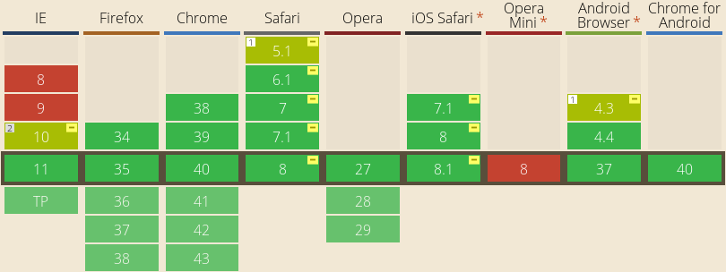

I have played around with Flexbox a bit during the last few days. The browser
support acctually really surprised me. I guess the lacking support in IE is what
stops people from using it in real life.

According the [caniuse.com/flexbox](http://caniuse.com/#feat=flexbox) around 80%
of all people using the web would be able to render flexbox. Nothing near
perfect, but still enough for some specific usecases I would say.

CSS-tricks have
[an awesome guide](http://css-tricks.com/snippets/css/a-guide-to-flexbox/) to
all the flexbox properties. It really covers most of it with some nice graphics.

I have heard some things about it being computationally heavy in some browsers.
Other than that, it is the perfect solution in many ways. CSS might not be such
a pain in the future after all. I am working on some more advanced layouts with
flexbox. I might post some of that here later on.
