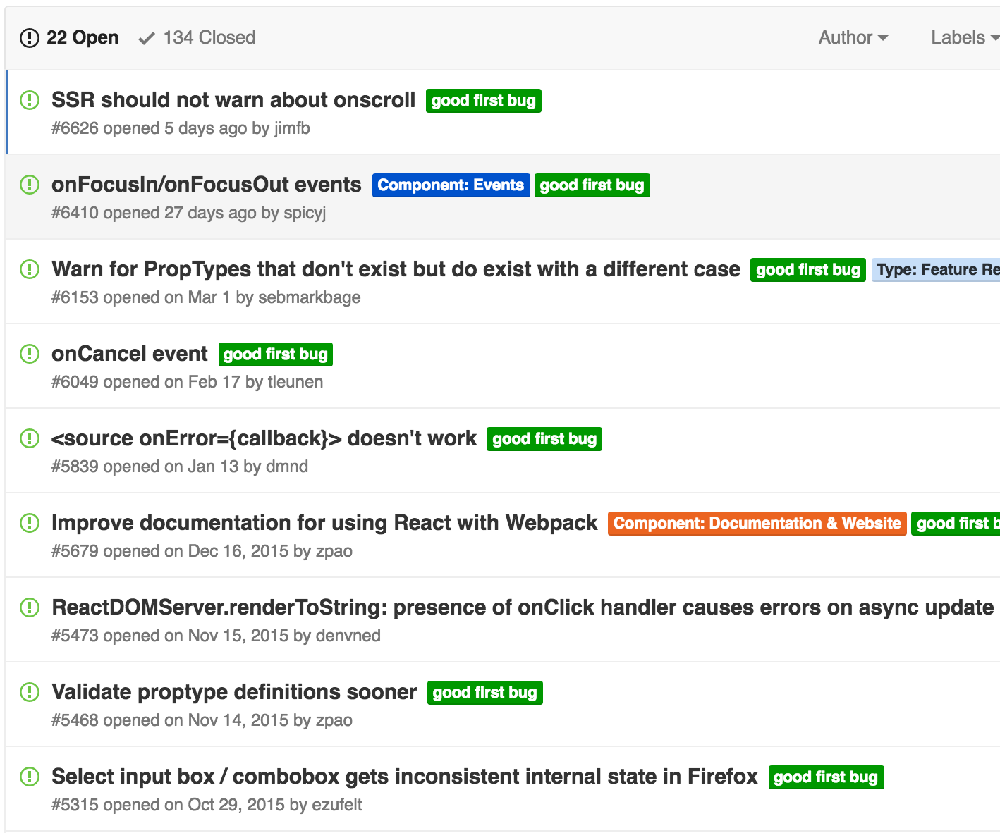

I've been writing a bit of React during the last few months. Today I decided
that I'm going to really make an effort to contribute. I've had this idea before
when working with Angular and other frameworks, but it is intimidating. I guess
I'm afraid of feeling stupid and rejected.

I feel fairly comfortable with JavaScript, JSX, ESlint and all the other tooling
and techniques that surrounds web developers today. But this thing is something
else. This feels too hard for me. Contributing to React means someone at
Facebook, or at least a member of the core team, needs to look at my code and
decide that it's good enough. And on top of that decide to merge it. That's
scary. I don't write that kind of code. Those guys are geniuses. I'm not.

_F\*\*k_ this, I should at least give it a shot. Where do I start? I know how to
use React, but I don't know how it works internally. I have no idea what needs
fixing, what features they are looking to implement or what can be optimized.

It turns out that the developers involved in React are making it easier to get
into contributing. They are actually categorizing some issues on GitHub as
[_good first bug_](https://github.com/facebook/react/issues?q=is%3Aissue+is%3Aopen+label%3A%22good+first+bug%22).
That's awesome.

Right now, there are 22 open issues in that category. Most of them are quite
old. Are the developers really not touching these to give us a chance? Maybe
they're just not important enough to fix. I don't care, it's a perfect entry
point for someone like me.

Maybe I'm moving a bit to fast. Even if I find an issue that needs fixing, I
wouldn't know where to start. I feel like React is this gigantic magic box. I
should probably spend some time demystifying that first. That's part 2.
