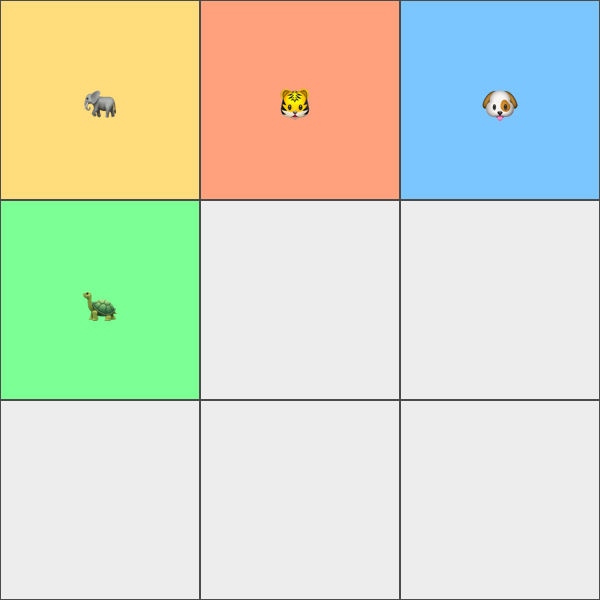
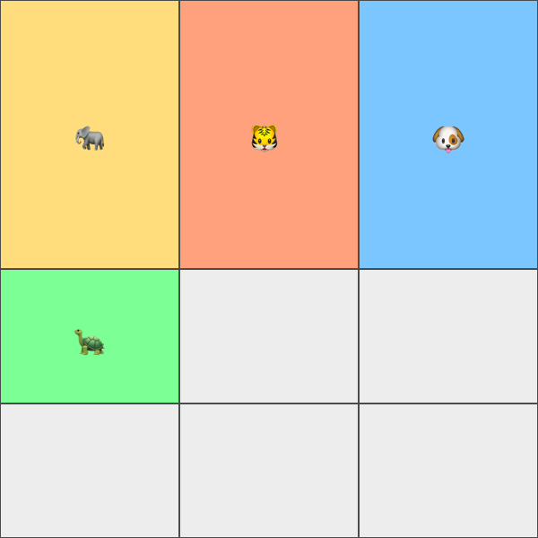
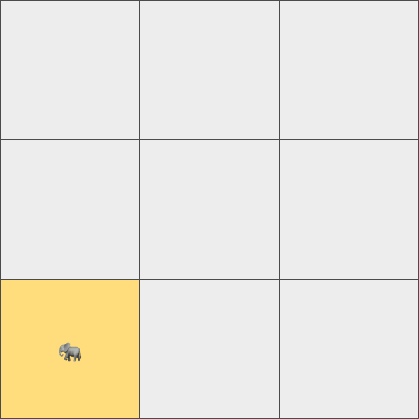
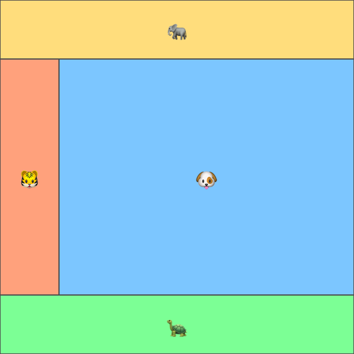

Flexbox is awesome. So why would we spend time on something like CSS Grid? Well,
they’re not really meant to solve the same tasks.

Flexbox works really well in one dimension. It’s great at placing items in a row
or a column in different ways. Unfortunately not all UI’s are as simple as a row
or a column. Some layouts are actually grids.

For the sake of simplicity; this is all the markup we’ll use:

```html
<div class="zoo">
	<div class="elephant">🐘</div>
	<div class="tiger">🐯</div>
	<div class="dog">🐶</div>
	<div class="turtle">🐢</div>
</div>
```

Sure, not all UIs are a combination of animals either, but this one is.

## 1. Defining the grid

The .zoo element is the container here. And in the CSS Grid universe the
container makes all the important decisions. Just like with Flexbox.

Lets create an evenly spaced out 3x3 grid:

```html
<div class="zoo">
	<div class="elephant">🐘</div>
	<div class="tiger">🐯</div>
	<div class="dog">🐶</div>
	<div class="turtle">🐢</div>
</div>
```

There you go, that’s a basic grid with three rows, and three columns. What we’re
actually defining here are the sizes of the rows and columns.

An issue here is that columns and rows are not really fitted to the available
space. What if the container spans the complete screen, but the columns and rows
are only using that tiny 300px by 300px area?

The CSS Grid spec includes a new unit: fr. It represents a number of fractions
in the context of a grid container. A better way of defining the grid above
using fr would be like this:

```css
.zoo {
	display: grid;
	grid-template-rows: 1fr 1fr 1fr;
	grid-template-columns: 1fr 1fr 1fr;
}
```

Good job, here’s your grid! 👊 The items are automatically positioned in the
grid in a row-by-row fashion by default.



All the rows and columns are evenly distributed since they all claim one
fraction each. Let’s say the first row would be 2fr, then that row would be
allocating half the space. Since 1 + 1 + 2 = 4.



## 2. Positioning the items

One of the trickier parts about CSS Grid is actually positioning the items. One
way of placing an item inside the container is to specify the starting and
ending lines both horizontally and vertically.

A three column grid has four vertical lines. Same goes for a grid with three
rows. It consists of four horizontal lines. The first column line, which is the
left-most edge of the grid, has index 1.

If we would want to position the elephant in the bottom left cell of the grid
the lines would be 3 to 4 vertically, and 1 to 2 horizontally.

```css
.elephant {
	grid-row: 3 / 4;
	grid-column: 1 / 2;
}
```



Note: grid-column and grid-row are shorthand properties for grid-column-start,
grid-column-end, grid-row-start and grid-row-end.

### 2.1. Items in pre-defined areas

It is also possible to place an item within an area. These are defined by the
grid container, and makes the process a bit easier for each item. Instead of
keeping track of lines the item can just pick an area and be done with it.
Here’s what we’re building with areas:



Areas are defined with grid-template-areas on the container and it comes with a
bit of a weird syntax:

```css
.zoo {
	display: grid;
	grid-template-rows: 200px auto 200px;
	grid-template-columns: 200px auto;
	grid-template-areas:
		"header header"
		"sidebar content"
		"footer footer";
}
```

`grid-template-areas` takes and argument for each row previously defined. Each
argument should specify what to place in each column, inside that particular
row.

This could be a basic site layout with a header area at the top, a dynamic main
area with content and sidebar in the middle and a footer at the bottom. Within
the main area, there’s a sidebar on the left and a large space for content on
the right.

It’s also possible to leave a cell empty. “header .” would define the header
area in the first cell, and no area at all in the second one.

Now let’s ditch all of that messy line mapping for a much cleaner item
positioning syntax:

```css
.elephant {
	grid-area: header;
}
.tiger {
	grid-area: sidebar;
}
.dog {
	grid-area: content;
}
.turtle {
	grid-area: footer;
}
```

How clean is that? 👌😍

---

That’s it, welcome to the wonderful world of CSS Grid. You can still use Flexbox
wherever you feel like it though. An item within a grid can be defined as a
Flexbox container.

As usual CSS-Tricks digs in to all the juicy details in their Complete Guide to
Grid. That’s a great resource for further reading.
