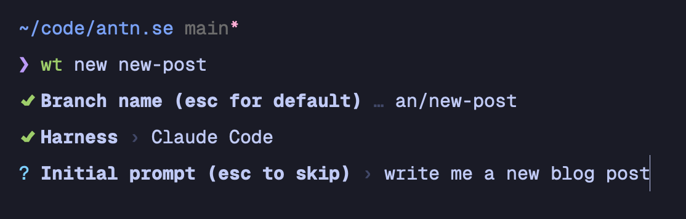

I use git worktrees a lot nowadays. It became more natural as I started
running a bunch of agents in parallel sometime late last year. Before
that I was happy doing a single thing at a time. A lot has changed [in a couple of months](/how-i-use-ai-in-2025). Now, it's more chaotic.
I am planning and reviewing, not spending much time actually implementing any more.

As this pattern emerged, I felt like a needed a simple tool to spin up
new worktrees from the current repository. I ~built~prompted it myself, to fit
my stack:

- tmux: I run one session per project. I used windows a bit, for
  sketching out a new idea, running some one-off process or something
- neovim: my editor of choice. I love that it's just a pane in the tmux
  window
- TUI-based coding agent: mainly claude code, but I have dabbled with
  OpenCode and Pi. It's also just a pane in my windows, next to vim

So here's the spec: I want a quick path to a clean ready-to-go worktree,
within the same tmux session, with panes configured the way I like them.

I already have [my dotfiles](https://github.com/antonniklasson/dotfiles) setup conveniently for this. I have
`~/.dotfiles/bin` registered in my `$PATH` so usually add little tools
like this in there.

I basically told Claude Code about all of this, and we built it together
over a couple of prompts. It has some more features, but that's
essentially it.

Once I started using this I realised I needed some way of configuring
the worktree to be warmed up for me. I have `direnv` for a couple of
tweaks to the environment, we need the monorepo to be built with
`pnpm install` and `pnpm build` before `pnpm dev` works, and the
turborepo cache was clearly missing.

I spoke to the AI about this, and we landed on a pretty neat concept:
`.worktree-setup`. This is a plain text file that lists out anything I
would like to copy over, and then any commands I would like to run in the new
worktree. That's all I need! The new tool looks for this file in the
clone it spawns the new tree from, and asks me to add it if it can't
find it. The setup file is globally ignored in `~/.gitignore`.

That's the basic run down of how what my flow looks like here. Over the
last couple of weeks I have expanded it a bit, so now I also get a
question about what the initial prompt should be for the harness. It
kicks off in the background, so I can come back to it later. Pretty
convenient. Check out the complete source code here: [dotfiles/blob/main/bin/wt](https://github.com/antonniklasson/dotfiles/blob/main/bin/wt)

### A note on friction

This flow has been working almost _too_ well for me. It allows me to
kick off a new background agent on my computer within a couple of
seconds. Sometimes I tell it to research a linear issue ID, so input
from me is quite minimal.

The downside of this is that I'm doing too many things at once. I have
really felt fatigued lately, my brain can't handle this many ongoing
tasks. So I'm dialing it back down. But similar to any other technology
shift, we need to adapt to it, not get rid of it. I want to lean into
this way of working, but I'm learning about what my collaboration with
coding agents should be.
