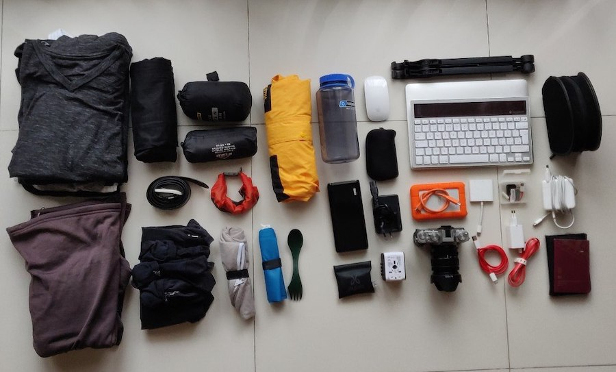

The second half of 2018 involved quitting my job, starting my own company, finding my first freelancing gig and actually making some money as an independant software developer. It has been great, and I do not regret it for a second. One of the main reasons for making this change is the fact that I am my own boss now. I am not limited to five weeks of vacation or saying yes to things that do not excite me.

During the last few years I have thought a lot about trying this _digital nomad_ thing. Travelling and working _at the same time_ sounds almost to good to be true. So I decided to try it, at least for a few weeks. The month of january has been kind of an experiment. I decided to take a break from the ongoing freelance gig I started back in october and head out to south-east asia. I wanted to ditch darkness that is swedish january, I wanted to work on a few different side-projects and I also decided to give solo-travel a shot. I am back home now, and looking back at these past weeks I actually feel proud of myself for doing it. Travelling solo has been weird, exciting, lonely and epic all at the same time.

Here is a few random thoughts regarding all of this:

**I love working on my own projects.** Finding some kind of financial sustainability in that should not be impossible. Incredibly hard, but not impossible. There's just something about the

**Travelling solo is an emotional rollercoaster.** It takes some getting used to, but I have actually enjoyed it more than I thought I would. It is kind of interesting to conduct experiments on myself, but psychologically tiring at the same time.

**The real value is in mixing the nomad life and "normal" life.** All of this is nice, but it comes with other challenges than life back home. I will be boring, lonely and challenging if not daily then atleast weekly. Right now, I am really looking forward to get back home, play some squash, have a beer with a friend and _grind_ a bit. There's some kind of charm in everyday-life too. I just need to remember that in three days when I am knee deep in snow.

**Packing as light as possible was a great decision**

