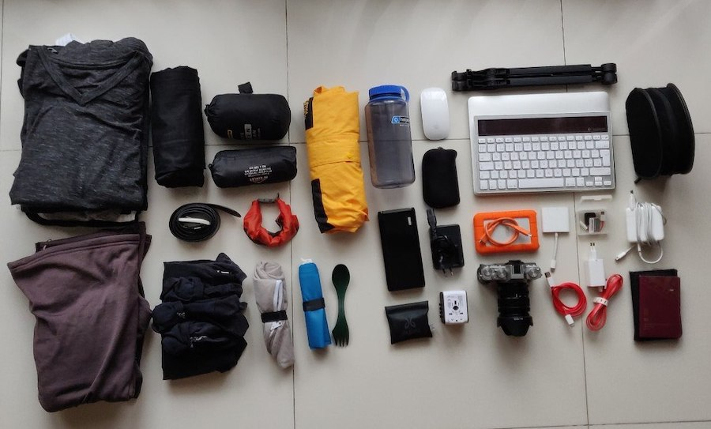

The second half of 2018 involved quitting my job, starting my own company, finding my first freelancing gig and actually making some money as an independant software developer. It has been great, and I do not regret it for a second. One of the main reasons for making this change is the fact that I am my own boss now. I am not limited to five weeks of vacation or saying yes to things that do not excite me.

During the last few years I have thought a lot about trying this _digital nomad_ thing. Travelling and working _at the same time_ sounds almost to good to be true. So I decided to try it, at least for a few weeks. The month of january has been kind of an experiment. I decided to take a break from the ongoing freelance gig I started back in october and head out to south-east asia. I wanted to ditch darkness that is swedish january, I wanted to work on a few different side-projects and I also decided to give solo-travel a shot. I am back home now, and looking back at these past weeks I actually feel proud of myself for doing it. Travelling solo has been weird, exciting, lonely and epic all at the same time.

Here is a few random thoughts regarding all of this:

**I love working on my own projects.**
I just enjoy the quick iterative work that is possible when I am the only person involved in making the decisions. That might change over time, and having colleagues that care and are invested is of course incredibly valuable, and fun. But right now I really enjoy it. Finding some kind of financial sustainability in that should not be impossible. Incredibly hard, but not impossible.

There is just something fundamentally _fun_ and _exciting_ about thinking about a problem and trying to come up with a solution that makes it a smaller problem, or even eliminates it completely.

**Travelling solo is an emotional rollercoaster.**
It will for sure take some getting used to, but I have actually enjoyed it more than I thought I would. I found myself feeling lonely from time to time, but it was nothing I could not manage. For the next trip I would like to actually invest myself a bit more in meeting new people instead of just "getting by". But where is the fun if not in growing and challenging yourself?

**I do not have to choose between being homeless or a 9-5 zombie.**
I think for me it would be great to find some kind of balance between the routines and _grind_ of everyday life and the nomadic, minimal lifestyle. All of this is nice, but it comes with other challenges than life back home. I will be boring, lonely and challenging if not daily then atleast weekly. Right now, I am really looking forward to get back home, play some squash, have a beer with a friend and _grind_ a bit. There's some kind of charm in everyday-life too. I just need to remember that in three days when I am knee deep in snow.

**Packing as light as possible was a great decision**
I could not be more happy that I decided to travel as light as possible. I forced myself to bring only the items I was sure I would either use daily, or that I could not get a hold of once at my destination. I carried everything in a 30 liter backpack. That was a first for me and required some thinking. I bought packing cubes and made sure I had everything organized in pouches.

**I can design the life I want to live.**
This still sounds pretty crazy to me, but this trip somehow confirmed that idea in me. There is not really anything that can stop me from doing whatever I want. Such a millenial thing to say, but it is true. Moving forward it is more a question about what I find fullfilling, fun, interesting and challenging enough to spend time on.

**The bare essentials are enough for me to be comfortable**
I do not _need_ a fancy car, takeaway sushi, nice clothes or other luxury products in my life. It is of course always fun and comfortable to pay for "luxury". But just knowing that I only depend on surrounding myself with the people I love, a roof over my head, a warm bed at night and a power outlet for my laptop is a nice feeling. I will be fine no matter what.

**Controlling my own time is incredibly easy to get used to, but hard to let go of.**
The biggest thing in all of this is the fact that I can control my own time, for real. I can wake up whenever I want, I can go workout whenever.
